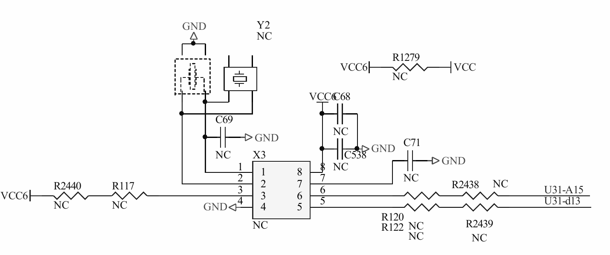
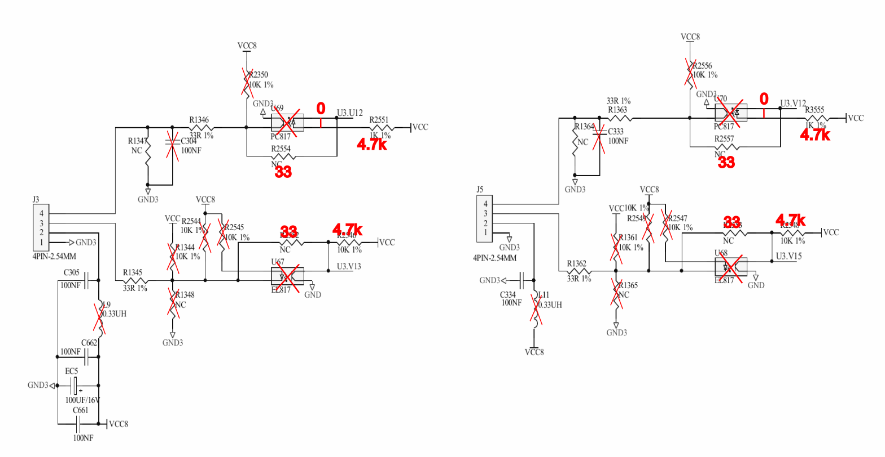

# EBAZ4205-PetaLinux
This repo contains an example PetaLinux and Vivado project for the EBAZ4205 board. It has been created with Vivado 2020.1 and PetaLinux 2020.1.

## Hardware

I2C is routed to the unpopulated X3 header. You need to place resistors on the unpopulated footprints in order to use it. I put a 50mil header on the SO-8 footprint, YMMV.

The remaining signals are routed as follows:

| IO port pin | FPGA signal        |
| ----------- | ------------------ |
| LED1        | gpio_0_tri_io[1]   |
| LED2        | gpio_0_tri_io[0]   |
| DATA3_5     | SPI0_SS_O_0        |
| DATA3_6     | gpio_0_tri_io[7]   |
| DATA3_7     | gpio_0_tri_io[6]   |
| DATA3_8     | SPI0_MOSI_O_0      |
| DATA3_9     | SPI0_SCLK_O_0      |
| DATA3_11    | gpio_0_tri_io[5]   |
| DATA3_14    | GPIO_0_0_tri_io[1] |
| DATA3_15    | GPIO_0_0_tri_io[0] |
| DATA3_16    | SPI1_SCLK          |
| DATA3_17    | SPI1_SS            |
| DATA3_18    | SPI1_MOSI          |
| DATA3_19    | SPI1_MISO          |
| DATA3_20    | GPIO_0_0_tri_io[4] |
| J5_PWM      | GPIO_0_0_tri_io[2] |
| J5_SPEED    | GPIO_0_0_tri_io[3] |
| DATA1_18    | SPI0_MOSI_O_1      |
| DATA1_19    | SPI0_SCLK_O_1      |
| DATA1_20    | SPI0_SS1_O_0       |
| J3_PWM      | pwm_l_out          |
| J3_SPEED    | pwm_r_out          |

SPI1 is implemented using an IP core. SPI0 is the PS SPI. MOSI and CLK of this SPI bus are duplicated. MISO is not routed out.

J3_PWM and J3_SPEED provide unfiltered PWM audio outputs.

In order to use these (and the userspace-controllable GPIOs on J5), you might want to mod the J3/J5 connectors, remove the opto couplers in order to use them as plain 3.3V GPIOs. Here's an idea how to do that:

## Software
I assume you have modded the board for SD boot (move resistor from R2584 to R2577).

### PetaLinux

In order to boot the PetaLinux system, copy the 3 files `BOOT.BIN`, `boot.scr` and `image.ub` from the `images` subdir onto a FAT32-formatted SD card.

Network configuration is set to DHCP, a serial console will be available on J7. Username/password is root/root. There is no persistent storage, the system runs from ramdisk. This means that a new SSH key is generated at every boot.

### Raspbian

Analog Devices' Kuiper Linux is a modified Raspbian for use on Zynq-7000 boards (among others). I recommend to use that as a basis. To support the EBAZ4205, you need to modify boot partition and rootfs. Put the `BOOT.BIN` from `images` and `boot.scr` and `uImage` from `images/raspbian` on the FAT32 boot partition. 
The kernel modules matching the PetaLinux kernel in the uImage need to copied to the rootfs manually: For your convenience, you can find the PetaLinux rootfs in a cpio.gz in `images/raspbian`. Open it with Midnight Commander and copy over the kernel modules manually into Raspbian's rootfs.
